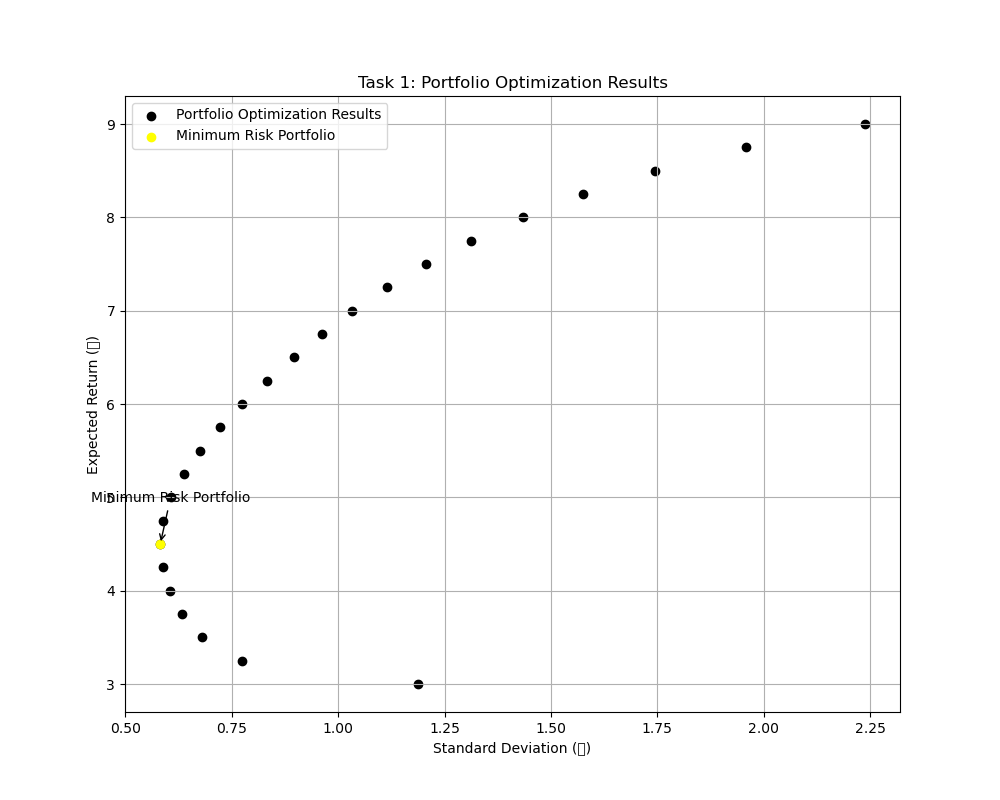

# Portfolio Optimization

Markowitz mean-variance portfolio optimization using Python and Gurobi. The project explores four distinct optimization scenarios that represent common strategies in investment portfolio management, each generating an efficient frontier to visualize the risk-return trade-off.

> Developed as part of the **Big Data for Computational Finance (CF969)** module at the University of Essex.

---

## Overview

The project constructs and solves quadratic optimization problems to find portfolios that minimize risk (variance) for a range of target returns. A covariance matrix is built from simulated asset data, and Gurobi is used as the solver.

**Four optimization scenarios are explored:**

1. **Fully invested portfolios** — all capital must be allocated (weights sum to 1)
2. **Partial investment** — capital can remain uninvested (weights sum ≤ 1), modeling a risk-free asset
3. **Minimum return constraint** — portfolios must meet or exceed a target return (≥ r)
4. **Short selling allowed** — negative weights are permitted, expanding the feasible region

Each scenario produces an efficient frontier and highlights the minimum risk portfolio.

---

## Results

| Scenario | Key insight |
|----------|-------------|
| Task 1 — Fully invested | Classic efficient frontier; minimum risk at σ ≈ 1.0, return ≈ 5.0 |
| Task 2 — Partial investment | Frontier extends to lower risk levels (σ starts near 0.5) due to cash option |
| Task 3 — Return ≥ target | Similar shape to Task 1 but portfolios can exceed the target return |
| Task 4 — Short selling | Tighter frontier; short positions enable hedging and lower overall risk |

### Example — Efficient frontier (Task 1)



---

## Project structure

```
portfolio_optimization/
├── src/
│   ├── task1.py          # Fully invested portfolios
│   ├── task2.py          # Partial investment portfolios
│   ├── task3.py          # Target return constraint
│   ├── task4.py          # Short selling allowed
│   └── utils.py          # Shared plotting utilities
├── notebook/
│   └── portfolio_optimization.ipynb
├── plots/                # Generated efficient frontier plots
├── main.py               # Run all tasks
├── requirements.txt
└── README.md
```

---

## Getting started

```bash
# Clone the repository
git clone https://github.com/melekkuru/portfolio_optimization.git
cd portfolio_optimization

# Create a virtual environment (optional)
python -m venv venv
source venv/bin/activate  # macOS/Linux
venv\Scripts\activate     # Windows

# Install dependencies
pip install -r requirements.txt

# Run all tasks
python main.py
```

**Prerequisites:** Python 3.8+ and a valid [Gurobi license](https://www.gurobi.com/academia/academic-program-and-licenses/) (free for academic use).

---

## Technologies

Python · Gurobi · NumPy · Matplotlib

---

## License

This project is for educational purposes. Feel free to use it as a reference.
